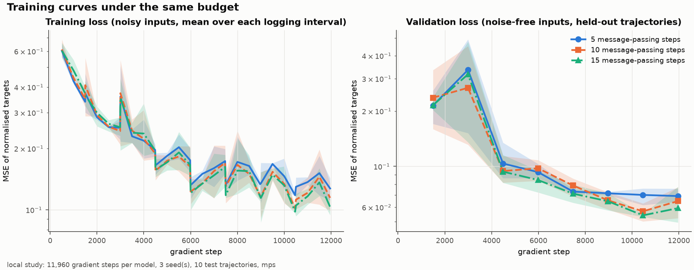
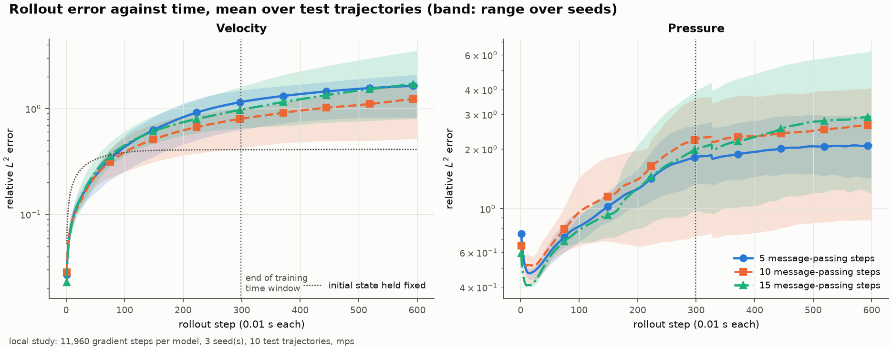
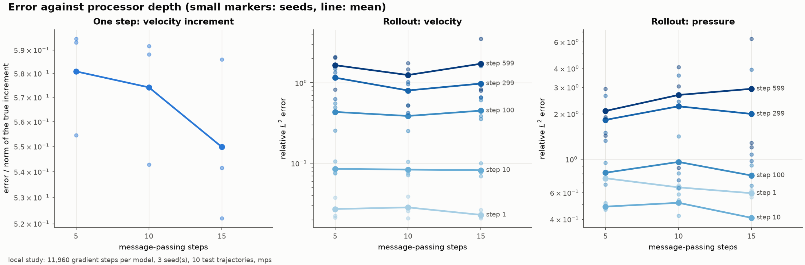
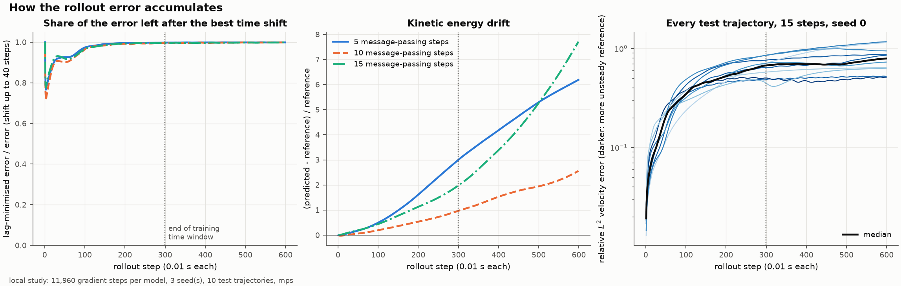
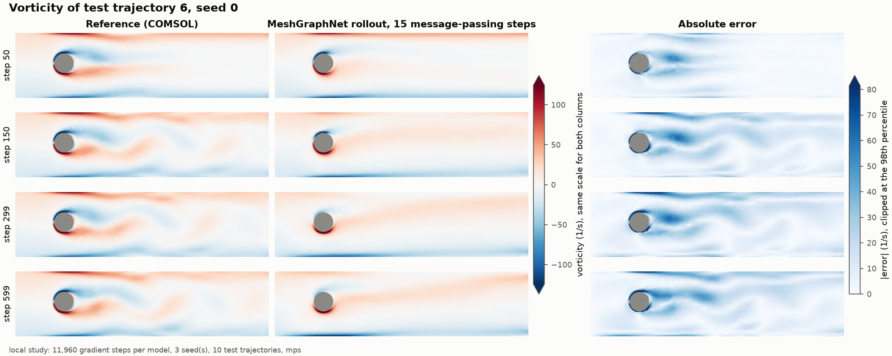
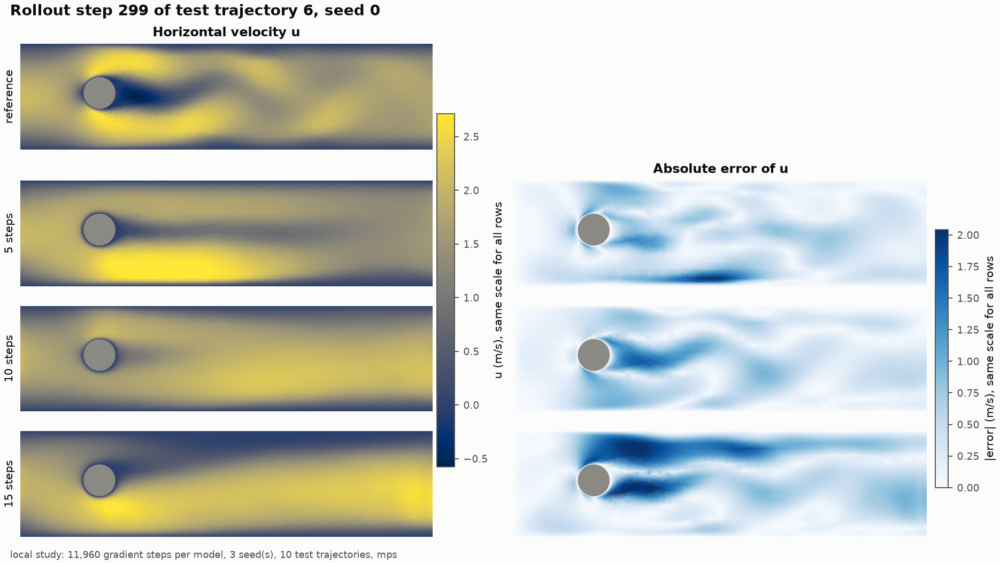
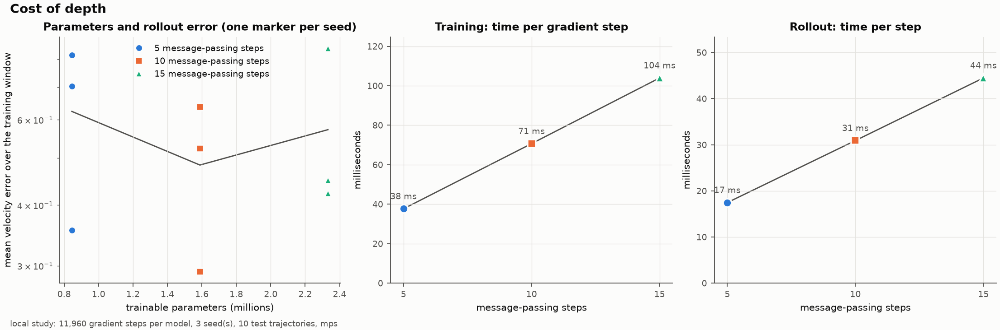

# Message-Passing Depth of MeshGraphNet for Vortex Shedding

A parameter study built on the MeshGraphNet vortex-shedding example of [NVIDIA PhysicsNeMo](https://github.com/NVIDIA/physicsnemo). The MeshGraphNet model, the dataset class with its graph construction and normalisation, and the rollout procedure are PhysicsNeMo's. This repository adds a controlled experiment around them: the number of message-passing steps of the processor is varied, every model is trained with the same data and the same number of gradient steps, and one-step accuracy, autoregressive rollout error and cost are recorded per run.

**Question.** How does the capacity of MeshGraphNet, set by the number of message-passing steps, affect one-step prediction accuracy and the accumulation of error in autoregressive rollouts of vortex shedding?

## Status of the experiments

| Study | Configuration | Gradient steps per model | Device | Status |
|---|---|---|---|---|
| Pipeline check | `configs/smoke.yaml` | 38 | CPU, Apple MPS | SMOKE: run, no results reported from it |
| Reduced study | `configs/local.yaml` | 11,960 | Apple MPS | LOCAL/REDUCED: run, 9 models (3 depths, 3 seeds) |
| Fixed-budget reduced study | `configs/full.yaml` | 119,600 | CUDA | CUDA/FULL: PENDING, not run |
| NVIDIA's settings | `configs/official.yaml` | 2,990,000 | CUDA | PENDING, requires larger compute, not run |

All numbers and figures below come from the `local` study. It trains each model for 0.4 % of the sample presentations of NVIDIA's configuration and is not a reproduction of NVIDIA's result. No CUDA result of any kind is reported in this repository.

## Physical problem

A viscous incompressible fluid flows through a plane channel past a circular cylinder. The velocity $\mathbf{u} = (u, v)$ and pressure $p$ satisfy the Navier–Stokes equations

$$\partial_t \mathbf{u} + (\mathbf{u}\cdot\nabla)\mathbf{u} = -\nabla p + \nu\,\Delta\mathbf{u}, \qquad \nabla\cdot\mathbf{u} = 0,$$

with a prescribed inflow profile, no slip on the channel walls and on the cylinder, and an open outflow boundary. At low Reynolds number the wake behind the cylinder is steady. Above a critical value the wake becomes unstable and vortices of alternating sign detach periodically from the two sides of the cylinder and are carried downstream: the von Kármán vortex street. The flow is then periodic in time, with a frequency and amplitude that depend on the inflow speed, the cylinder diameter and the confinement by the walls.

A learned time stepper for this flow has to do two things. It has to reproduce one time step accurately, and it has to remain accurate when it is applied to its own output hundreds of times. In a periodic flow the second requirement is the harder one: a small error in the shedding frequency grows into a phase shift between the predicted and the reference vortex street, and the pointwise error becomes large even if the predicted flow looks physically plausible.

## Dataset

The data are the `cylinder_flow` dataset released by DeepMind with *Learning Mesh-Based Simulation with Graph Networks* (Pfaff et al., ICLR 2021), the same files the NVIDIA example uses.

| | |
|---|---|
| Source | `https://storage.googleapis.com/dm-meshgraphnets/cylinder_flow/` (download script of [deepmind-research/meshgraphnets](https://github.com/google-deepmind/deepmind-research/tree/master/meshgraphnets)) |
| Simulator | COMSOL (field `simulator` of `meta.json`) |
| Splits | 1000 training, 100 validation and 100 test trajectories, one TFRecord file per split |
| Size | 16.4 GB: `train.tfrecord` 13.65 GB, `valid.tfrecord` 1.36 GB, `test.tfrecord` 1.36 GB, about 13.6 MB per trajectory |
| Trajectory | 600 time levels with $\Delta t = 0.01$ s on a fixed triangular mesh |
| Fields | node positions, triangles, node type, velocity (2 components) and pressure at every node and time level |
| Licence | the deepmind-research repository is released under Apache-2.0; its README states no separate licence for the data files. No data are redistributed here |

Every trajectory has its own mesh. In the 80 training and test trajectories inspected for this study the channel is 1.6 by 0.41, the meshes have 1735 to 2036 nodes (about 3500 triangles), the cylinder diameter ranges from 0.047 to 0.159, its centre from $x = 0.16$ to $0.49$ and $y = 0.10$ to $0.29$, and the peak inflow velocity from 0.33 to 2.22. Geometry and inflow speed therefore both vary, and with them the Reynolds number; the viscosity is not part of the files, so no Reynolds numbers are quoted. Some trajectories shed vortices and others stay steady: the ratio of the velocity fluctuation to the velocity over the second half of a trajectory ranges from below 0.001 to 0.15. The inflow and wall velocities are constant in time.

`scripts/download_data.py` downloads only the first $N$ trajectories of each file. The files hold one record per trajectory and the dataset class reads the first `num_samples` records, so a file cut at a record boundary is a valid input. `data/cylinder_flow/manifest.json` records the number of trajectories, the byte count and the SHA-256 of what was written.

## Graph representation

The upstream class `physicsnemo.datapipes.gnn.vortex_shedding_dataset.VortexSheddingDataset` turns each trajectory into one graph that is reused for all its time steps.

| | |
|---|---|
| Nodes | the mesh nodes |
| Edges | every mesh edge in both directions (about 10,800 directed edges per graph) |
| Node input, 6 features | velocity $(u_t, v_t)$ and a one-hot node type: interior, inflow, outflow, wall |
| Edge input, 3 features | relative position of the two end nodes and its length |
| Target, 3 features | velocity increment $(u_{t+1} - u_t,\ v_{t+1} - v_t)$ and pressure $p_{t+1}$ |
| Normalisation | node inputs, targets and edge features are standardised with statistics of the training subset |
| Training noise | Gaussian noise of standard deviation 0.02 is added to the input velocity of interior nodes and subtracted from the target increment, so that the model learns to correct perturbed states |

The pressure is an output only. It is never fed back, so rollout errors enter the pressure through the velocity.

## MeshGraphNet

MeshGraphNet (Pfaff et al., 2021) is an encode-process-decode graph network. Two MLPs encode node and edge features into latent vectors of size 128. The processor applies $K$ message-passing steps. Each step first updates every edge from its latent vector and those of its two end nodes, then updates every node from its latent vector and the sum of its incoming edge vectors, both with residual connections. A final MLP decodes the node latents into the three targets. All MLPs have two hidden layers of width 128 with ReLU activations, and all except the decoder end with layer normalisation.

$K$ sets how far information travels in one prediction: after $K$ steps a node has received information from nodes up to $K$ mesh edges away. It is also the main capacity setting, because every step has its own weights:

| Message-passing steps $K$ | Trainable parameters |
|---|---|
| 5 | 845,059 |
| 10 | 1,588,739 |
| 15 (NVIDIA default) | 2,332,419 |

The model is used through `physicsnemo.models.meshgraphnet.MeshGraphNet`; $K$ is its constructor argument `processor_size`.

## Original NVIDIA example

| | |
|---|---|
| Example | [`examples/cfd/vortex_shedding_mgn`](https://github.com/NVIDIA/physicsnemo/tree/b45a5c810c741e6b41f8515be24c51121f8fc21f/examples/cfd/vortex_shedding_mgn) (`train.py`, `inference.py`, `conf/config.yaml`) |
| PhysicsNeMo commit | `b45a5c810c741e6b41f8515be24c51121f8fc21f` (main branch, 2 October 2026, version `2.3.0a0`) |
| Licence | Apache-2.0 |

The original trains one MeshGraphNet with 15 message-passing steps and hidden size 128 on the first 400 training trajectories and the first 300 time levels of each. One training sample is one (trajectory, time step) pair and the batch size is 1 per GPU. The loss is the mean squared error of the normalised targets. The optimiser is Adam with a learning rate of $10^{-4}$ multiplied by 0.9999991 after every gradient step. Training runs for 25 epochs, which is 2,990,000 sample presentations. The example's README reports 8 NVIDIA A100 GPUs with data parallelism. `inference.py` rolls the model out from the initial condition on 10 test trajectories for 300 steps and writes animations; the example computes no error metrics.

Two statements of the example's README differ from its code at this commit: the README describes 1000 training samples and 600 time steps, while `config.yaml` uses 400 trajectories and 300 time steps. This repository follows the code.

## What this repository changes

Original NVIDIA implementation, used through the installed package and not copied:

- the MeshGraphNet architecture and its message-passing layers;
- `VortexSheddingDataset`: TFRecord decoding, graph construction, edge features, noise and normalisation;
- `save_checkpoint` and `load_checkpoint`.

Adapted from the NVIDIA example, with the NVIDIA licence header kept and the changes stated in each file:

| File | Adapted from | Changes |
|---|---|---|
| `configs/official.yaml` | `conf/config.yaml` | upstream keys and values kept, except the `hydra` block and `data_dir`; study keys added below a marker |
| `src/mgn_vortex/model.py` | `train.py`, model construction | `processor_size` is passed explicitly |
| `src/mgn_vortex/engine.py` | `train.py`, `MGNTrainer` and epoch loop | one device (CUDA, MPS or CPU) instead of distributed training, a seeded shuffling loader, no Weights & Biases, loss history, validation loss, timings |
| `src/mgn_vortex/rollout.py` | `inference.py`, `MGNRollout.predict` | a function over one trajectory that returns arrays, with an option to feed the reference state at every step |

The loss, optimiser, learning-rate schedule, batch size, noise level, normalisation, boundary treatment and time integration are unchanged. A test runs NVIDIA's `MGNRollout.predict` and this repository's `rollout` on the same model and data and requires the predicted fields to agree to $10^{-5}$ (`tests/test_rollout.py`, enabled by pointing `PHYSICSNEMO_UPSTREAM` at a PhysicsNeMo checkout).

Added in this repository:

- the study over `processor_size` with seeds, under one training budget;
- a validation loss on held-out trajectories during training;
- error metrics for one-step predictions and rollouts, a lag-minimised error, kinetic energy and vorticity diagnostics (`metrics.py`, `mesh_ops.py`, `evaluation.py`);
- a partial downloader, a timing probe with a budget guard, run metadata, figures, tests and a Kaggle launcher.

Three properties of the upstream dataset class matter for the design and were kept as they are:

- Items of the same trajectory are one graph object whose features are overwritten on access. A batch with two samples of one trajectory would contain the same sample twice, so every configuration keeps the upstream batch size of 1 (`tests/test_data.py::test_items_share_one_graph_object`).
- The training noise is drawn once when the dataset is constructed, not once per epoch. With several epochs a model sees the same noisy copy of each sample again.
- The normalisation statistics are computed after the noise is added. The standard deviation of the velocity increment is then dominated by the noise (0.019 with noise against a noise level of 0.02).

## Experiment

**Capacity parameter.** `processor_size` $K \in \{5, 10, 15\}$. Hidden size, MLP depth, aggregation and every other model setting stay at the upstream values. Hidden size is not varied.

**Fixed training budget.** Within a study every model receives the same training set, the same noise realisation for a given seed, the same number of epochs and therefore the same number of gradient steps, with the upstream optimiser and schedule. Models are compared at equal data and equal steps, not at equal wall-clock time: the deeper models cost more per step.

| | `local` | `full` | `official` |
|---|---|---|---|
| Training trajectories (first $N$ of `train.tfrecord`) | 40 | 200 | 400 |
| Time levels per trajectory | 300 | 300 | 300 |
| Epochs | 1 | 2 | 25 |
| Gradient steps per model | 11,960 | 119,600 | 2,990,000 |
| Share of the upstream budget | 0.4 % | 4 % | 100 % |
| Processor sizes | 5, 10, 15 | 5, 10, 15 | 15 |
| Seeds | 0, 1, 2 | 0, 1, 2 | 0 |
| Validation trajectories | 5 | 10 | 10 |
| Test trajectories (first $N$ of `test.tfrecord`) | 10 | 50 | 10 |
| Rollout length | 599 steps | 599 steps | 299 steps |

`local` and `full` are fixed-budget reduced studies. `full` means the largest study planned for a single GPU session; it does not mean NVIDIA's reference run, which is `official`.

Rollouts in `local` and `full` start from the initial condition and run for 599 steps. The first 299 lie in the time window the models were trained on (on other trajectories); the remaining 300 extrapolate in time.

Runs are ordered by seed, so all three sizes are trained for one seed before the next seed starts, and only seeds that are complete for every size enter the evaluation.

## Evaluation

Errors are computed from the predicted fields in physical units. Norms are discrete $L^2(\Omega)$ norms with lumped nodal areas $w_i$ (one third of the area of the triangles around node $i$), so that the fine mesh near the cylinder is not over-counted:

$$\lVert f \rVert^2 = \sum_i w_i\,\lvert f_i\rvert^2, \qquad E_f(t) = \frac{\lVert f_\text{pred}(t) - f_\text{ref}(t)\rVert}{\lVert f_\text{ref}(t)\rVert}.$$

**One-step prediction.** The reference state at step $t$ is the input and the prediction for $t+1$ is compared with the reference, at every fifth step of every test trajectory. Because the flow changes little in 0.01 s, the relative error of the state is small even for a model that predicts no change. The error is therefore also reported relative to the true increment, $\lVert \mathbf{u}_\text{pred}(t+1) - \mathbf{u}_\text{ref}(t+1)\rVert / \lVert \mathbf{u}_\text{ref}(t+1) - \mathbf{u}_\text{ref}(t)\rVert$, pooled over steps and trajectories. A value of 1 is the error of predicting no change.

**Rollout.** The model starts from the reference initial condition and is applied to its own velocity output. $E_\mathbf{u}(t)$ and $E_p(t)$ are recorded at every step and tabulated at fixed horizons, together with the nodal RMSE. The error of holding the initial velocity fixed for all time is reported as a baseline.

**Diagnostics of the error accumulation.**

- *Lag-minimised error.* $E^\text{lag}_\mathbf{u}(t) = \min_{\lvert s\rvert \le 40} \lVert \mathbf{u}_\text{pred}(t) - \mathbf{u}_\text{ref}(t+s)\rVert / \lVert \mathbf{u}_\text{ref}(t)\rVert$. A prediction with the right flow pattern at the wrong phase has $E^\text{lag} \ll E$; a wrong amplitude or structure is not removed by a time shift.
- *Kinetic energy.* $\tfrac12 \sum_i w_i \lvert\mathbf{u}_i\rvert^2$ of the prediction against the reference, as a measure of drift in amplitude.
- *Vorticity.* $\omega = \partial_x v - \partial_y u$ from the piecewise-linear interpolant of the nodal velocity on the supplied triangulation, averaged to the nodes. It is first-order accurate and is used for the figures and for a relative error.

Lift, drag and Strouhal number are not computed. They would need boundary stresses on the cylinder, and the files give neither the viscosity nor a boundary-fitted stress evaluation; the first-order nodal gradients above are not accurate enough at the wall for a force integral.

## Results

All results are from the `local` study (status LOCAL/REDUCED): 9 models, 3 depths by 3 seeds, 11,960 gradient steps each on 40 training trajectories, evaluated on 10 test trajectories with 599-step rollouts, on an Apple M3 Pro (MPS, PyTorch 2.13.0). Values are means over test trajectories; where a spread is given it is the sample standard deviation over the 3 seeds. The files are in [`results/local`](results/local).

### One-step prediction

| $K$ | Parameters | Validation loss (normalised MSE) | Velocity increment error | Velocity state error | Pressure error | Velocity RMSE (m/s) |
|---|---|---|---|---|---|---|
| 5 | 845,059 | 0.069 ± 0.006 | 0.581 ± 0.023 | 0.0120 ± 0.0007 | 0.488 ± 0.007 | 0.0100 |
| 10 | 1,588,739 | 0.065 ± 0.012 | 0.574 ± 0.027 | 0.0115 ± 0.0007 | 0.445 ± 0.066 | 0.0100 |
| 15 | 2,332,419 | 0.059 ± 0.016 | 0.550 ± 0.033 | 0.0112 ± 0.0009 | 0.381 ± 0.021 | 0.0097 |

Errors are relative $L^2$ errors over the first 299 steps. The one-step error decreases with depth in the mean. For the velocity increment the decrease from 5 to 15 steps (0.031) is of the size of the seed standard deviation, but the ordering 5 > 10 > 15 holds within each of the three seeds, which share data and noise across depths. For the pressure the improvement from 5 to 15 steps (0.488 to 0.381) exceeds the seed spread.

The absolute level shows how far these models are from convergence: an increment error of 0.55 to 0.58 means the predicted change over one step is wrong by more than half of the true change (a model that predicts no change scores 1). The state error of about 1.1 % looks small only because the flow changes little in one step.



### Rollout

Relative $L^2$ velocity error of the autoregressive rollout at fixed horizons:

| $K$ | step 1 | step 10 | step 100 | step 299 | step 599 | mean over steps 1 to 299 |
|---|---|---|---|---|---|---|
| 5 | 0.027 ± 0.009 | 0.085 ± 0.018 | 0.43 ± 0.16 | 1.16 ± 0.46 | 1.65 ± 0.72 | 0.62 ± 0.24 |
| 10 | 0.028 ± 0.009 | 0.083 ± 0.018 | 0.39 ± 0.14 | 0.80 ± 0.33 | 1.25 ± 0.64 | 0.48 ± 0.18 |
| 15 | 0.023 ± 0.003 | 0.082 ± 0.017 | 0.45 ± 0.14 | 0.98 ± 0.55 | 1.72 ± 1.6 | 0.57 ± 0.23 |
| initial state held fixed | | | | | | 0.37 |

Per seed, mean velocity error over steps 1 to 299, and in brackets the number of the 10 test trajectories whose error exceeds 1 at some step:

| $K$ | seed 0 | seed 1 | seed 2 |
|---|---|---|---|
| 5 | 0.355 (3) | 0.815 (8) | 0.703 (9) |
| 10 | 0.291 (1) | 0.638 (7) | 0.523 (9) |
| 15 | 0.423 (2) | 0.843 (10) | 0.451 (3) |



- **No depth gives a usable rollout at this budget.** After roughly 100 steps every depth is worse on average than holding the initial velocity fixed, and the mean error exceeds 1 at the end of the rollout for all depths. Only two of the nine runs, both with seed 0 (5 and 10 steps), stay below the fixed-state baseline over the training window.
- **The one-step ranking does not carry over to the rollout.** The deepest model has the lowest one-step error in every seed but the lowest rollout error in only one seed. The 10-step model is best in two seeds and in the mean, but the differences between depths (0.48 to 0.62) are smaller than the spread over seeds (0.18 to 0.24). The data do not support a ranking of depths by rollout error.
- **The seed matters more than the depth.** Seed 0 gives clearly lower rollout errors than seeds 1 and 2 at every depth, although its one-step errors are only slightly lower. The seed fixes the training noise, the initial weights and the sample order.
- The pressure error behaves the same way: it is 0.4 to 0.5 after ten steps and above 1 from about step 150, with no consistent ordering by depth.



### Error accumulation



- **Growth is gradual, not explosive.** The velocity error rises quickly over the first 50 steps and then keeps growing more slowly. No rollout produced non-finite values. The predictions leave the reference without diverging numerically within 599 steps.
- **The error is not a phase error.** The lag-minimised error is 0.47 to 0.62 over the training window against 0.48 to 0.62 without a shift: the best time shift of up to 40 steps removes 1 to 2 % of the error. A shift helps slightly during the first 100 steps and not at all afterwards. The rollouts do not reproduce the reference wake at a different phase; they produce a different flow.
- **The kinetic energy drifts upward.** The predicted kinetic energy exceeds the reference by a factor of 2 to 4 at step 299 on average (relative error 1.1 to 3.0) and keeps growing during the extrapolation. The models add energy at every step. The drift is smallest for the 10-step models, consistent with their lower velocity error, with the same caveat about the seed spread.
- **The wake is not reproduced.** In the most unsteady test trajectory the reference develops a vortex street, while the rollout of the 15-step model keeps an attached, nearly steady wake and loses the shed vortices (figure below). Short rollouts of 10 steps look accurate (8 % error) and say nothing about this.
- **Leaving the training time window changes nothing visible.** The curves continue smoothly across step 299; the error is already large before the extrapolation starts.





Read together: within this budget, additional message-passing steps buy a measurable gain in one-step accuracy, most clearly in the pressure, and no measurable gain in long-horizon accuracy. The limiting factor of the rollouts here is the amount of training, not the processor depth. Whether deeper processors pay off once the models are trained far enough to hold a vortex street is the question the `full` study is designed to address.

### Computational cost

Measured with `scripts/probe.py --config local` on the Apple M3 Pro (MPS), 300 gradient steps per depth after a warm-up and one 599-step rollout, with no other computation running ([`results/local/probe.json`](results/local/probe.json)):

| $K$ | Parameters | Training throughput | Time per gradient step | Rollout time per step |
|---|---|---|---|---|
| 5 | 845,059 | 26.5 steps/s | 37.7 ms | 17.5 ms |
| 10 | 1,588,739 | 14.1 steps/s | 70.7 ms | 30.9 ms |
| 15 | 2,332,419 | 9.6 steps/s | 104.0 ms | 44.5 ms |

Cost grows linearly with depth: each additional message-passing step adds about 6.6 ms to a training step and 2.7 ms to a rollout step. The 15-step model costs 2.8 times as much per gradient step as the 5-step model. At equal gradient steps the deeper models therefore used more compute for no gain in rollout accuracy in this study.

The durations stored with the individual runs (`train_seconds`, `optimisation_seconds`, `rollout_ms_per_step` in `results/local`) were taken while other computations shared the machine and differ by up to a factor of 2 between seeds of the same depth. They are kept as recorded and are not used for the comparison above.



### Local compatibility

MeshGraphNet from PhysicsNeMo runs on Apple MPS without changes, including the `torch_scatter` aggregation, and its forward pass agrees with CPU to $5\times10^{-7}$. On this machine MPS trains the 15-step model at 9.6 steps/s. CPU training also works and is slower.

## Limitations

- The reported study is small. Each model is trained for 11,960 gradient steps on 40 trajectories, 0.4 % of the upstream budget, and evaluated on 10 test trajectories. The conclusions describe this regime. Whether the ranking of depths holds at 119,600 or 2,990,000 steps is not known; MeshGraphNet results in the literature rely on millions of steps.
- Models are compared at equal gradient steps. A comparison at equal training time would favour the shallower models further.
- NVIDIA's configuration (`configs/official.yaml`) and the single-GPU study (`configs/full.yaml`) have not been run. The Kaggle launcher has been checked statically (`tests/test_notebook.py`) but has not been executed on a CUDA machine, including its source build of `torch_scatter`.
- The cost figures are for Apple MPS and batch size 1. They show the trend with depth and do not predict CUDA throughput.
- The test trajectories are the first of the test file, and the time window is the first 600 steps from the initial condition, which includes the transient in which the wake develops.
- Only the processor depth was varied. Hidden size, noise level, learning rate and training-set size were held fixed, and interactions between them and depth were not studied.
- The properties of the upstream dataset class listed above (noise drawn once, statistics computed after the noise) were kept, so that the models are trained by NVIDIA's pipeline. Their effect on the results was not measured.

## Possible extensions

- Run `configs/full.yaml` on a CUDA GPU and compare the depth ranking with the reduced study.
- Vary the training budget at fixed depth to separate under-training from a capacity limit.
- Resample the training noise every epoch and measure the effect on rollout stability.
- Add multi-step (unrolled) training losses and compare the error accumulation.
- Measure the shedding frequency of predicted and reference wakes from a probe signal in trajectories with a periodic wake.

## Repository structure

```text
configs/            official.yaml (upstream settings), smoke.yaml, local.yaml, full.yaml
src/mgn_vortex/     config, data access, model construction, training engine, rollout,
                    metrics, mesh operators, evaluation, study loop, plotting, run metadata
scripts/            download_data.py, train.py, evaluate.py, plot_results.py, probe.py, results.py
tests/              unit and pipeline tests on a synthetic dataset in the upstream file format
kaggle/             run_cuda.ipynb, launcher for a CUDA session
results/            tracked summaries, metrics, histories and error curves of the studies
figures/            figures of the README
```

## Installation

Python 3.11 to 3.14. PhysicsNeMo is installed from the pinned commit and needs PyTorch 2.13 or newer. `torch_scatter` has no wheel for that PyTorch on the PyG index and is built against the installed PyTorch:

```bash
python -m venv .venv && source .venv/bin/activate
pip install "torch>=2.13" setuptools wheel
FORCE_ONLY_CPU=1 pip install torch_scatter --no-build-isolation
pip install -r requirements.txt
```

The CPU-only build of `torch_scatter` is sufficient on CUDA and MPS, because MeshGraphNet uses its sum aggregation, which is implemented with `torch.scatter_add_`. This was verified on CPU and Apple MPS (macOS arm64, PyTorch 2.13.0, `torch_geometric` 2.8, `torch_scatter` 2.1.2), where the forward pass on MPS agrees with CPU to $5\times10^{-7}$.

## Reproducing the experiments

```bash
# data: the first N trajectories of each split (1.2 GB for the local study)
python scripts/download_data.py --train 40 --valid 5 --test 10

# pipeline check, about one minute on a CPU
python scripts/train.py --config smoke

# reduced study on a laptop (MPS or CPU); --resume continues after an interruption
python scripts/train.py --config local --resume
python scripts/results.py publish runs/local
python scripts/plot_results.py --study results/local --out figures
```

`scripts/train.py --config <name> [overrides]` trains every (processor size, seed) run of a configuration and evaluates it; arguments after the options are Hydra overrides, for example `study.seeds=[0]` or `device=cpu`. `scripts/evaluate.py --config <name>` repeats the evaluation from the checkpoints.

Before a long study, `scripts/probe.py` measures the training and rollout speed of every processor size on the current device and projects the runtime:

```bash
python scripts/probe.py --config full --budget-hours 9
```

It exits with code 3 if the projection exceeds the budget and never changes the configuration.

### CUDA study on Kaggle

`kaggle/run_cuda.ipynb` checks out one commit by its full SHA, verifies `HEAD` and a clean tree, prints the GPU and all package versions, runs the tests, downloads 200, 10 and 50 trajectories (3.5 GB), runs the smoke study on CUDA and then the probe. The study starts only if `RUN_FULL = True` and the projection fits the remaining session budget; otherwise the notebook stops and reports the numbers without reducing epochs, seeds, data or model sizes. `RUN_OFFICIAL` controls NVIDIA's configuration separately and is off by default.

The cost on a Kaggle GPU has not been measured. From the measured cost ratio between depths and typical throughput of a T4 for graphs of this size, a rough expectation is 2 to 3 hours per seed and 6 to 9 hours for the three seeds of `configs/full.yaml`, and several days for `configs/official.yaml`, which is why the latter is not expected to fit a single session. The probe replaces this estimate with a measurement before anything is started.

After a CUDA run, the downloaded archive is integrated with

```bash
python scripts/results.py publish physicsnemo-meshgraphnet-vortex-full.zip
python scripts/plot_results.py --study results/full --out figures
```

Every study directory stores `study_metadata.json` with the timestamp, the commit and dirty state of this repository, the PhysicsNeMo version and commit, the device and GPU, the versions of Python, PyTorch, `torch_geometric`, `torch_scatter` and `tfrecord`, the dataset subset with file hashes, and the resolved configuration. Every run stores its seed, processor size, parameter count, steps, timings, peak GPU memory on CUDA, loss history and evaluation metrics.

## Tests

```bash
python -m pytest -q
PHYSICSNEMO_UPSTREAM=/path/to/physicsnemo python -m pytest -q   # adds the comparisons with the upstream files
```

The tests write a small synthetic dataset in the format of the DeepMind files and need neither the real data nor a GPU. They cover the configurations (upstream values kept, reduced studies change only budget keys), TFRecord counting and partial download, graph construction and features, parameter counts and the forward pass, agreement of MPS with CPU, the metrics and mesh operators on fields with known answers, the rollout (reference reproduction with an oracle, fixed boundary nodes, agreement with NVIDIA's rollout), reproducibility of training for a fixed seed, checkpoint round trips, the study outputs, and the structure of the Kaggle launcher.

## Attribution

- **NVIDIA PhysicsNeMo**, Apache-2.0, <https://github.com/NVIDIA/physicsnemo>. The model, dataset class and training example are NVIDIA's work. Example `examples/cfd/vortex_shedding_mgn` at commit `b45a5c810c741e6b41f8515be24c51121f8fc21f`. Adapted files and changes are listed in [What this repository changes](#what-this-repository-changes) and in [NOTICE](NOTICE).
- **MeshGraphNet and the `cylinder_flow` dataset**: T. Pfaff, M. Fortunato, A. Sanchez-Gonzalez, P. W. Battaglia, *Learning Mesh-Based Simulation with Graph Networks*, ICLR 2021, <https://arxiv.org/abs/2010.03409>.
- The contribution of this repository is the controlled depth study, the evaluation and diagnostics, the reproducibility tooling and the interpretation.

## License

Apache-2.0, see [LICENSE](LICENSE) and [NOTICE](NOTICE).
